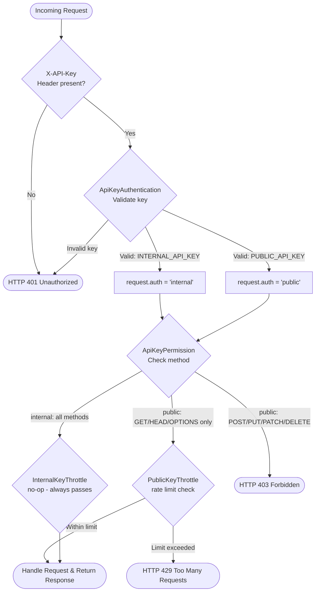

# API Overview

This backend exposes a **RESTful API** built with **Django REST Framework (DRF)**.
It provides endpoints for interacting with the application's data and supports full CRUD operations.

---

## Documentation

Two interactive documentation interfaces are available:

| Interface             | URL                                               | Description                                     |
| --------------------- | ------------------------------------------------- | ----------------------------------------------- |
| **Swagger (OpenAPI)** | [/api/docs/](https://sel2-2.ugent.be/api/docs/)   | Interactive docs with request/response examples |
| **Redoc**             | [/api/redoc/](https://sel2-2.ugent.be/api/redoc/) | Structured, readable endpoint reference         |

---

## Request Flow

Every incoming request passes through the following pipeline:



---

## Authentication: `ApiKeyAuthentication`

### How it works

- **Only authentication class** used across the entire project.
- Configured globally in `settings/base.py` via `REST_FRAMEWORK["DEFAULT_AUTHENTICATION_CLASSES"]`.
- No per-viewset configuration is needed.

### Header Format

All requests **must** include an `X-API-Key` header:

```
X-API-Key: <YOUR_KEY>
```

### Supported Key Types

| Key                | `request.auth` value | Access Level     |
| ------------------ | -------------------- | ---------------- |
| `INTERNAL_API_KEY` | `"internal"`         | Full CRUD access |
| `PUBLIC_API_KEY`   | `"public"`           | Read-only access |

> Key comparisons use `secrets.compare_digest` to prevent **timing attacks**.

---

## Permission: `ApiKeyPermission`

Works in tandem with `ApiKeyAuthentication` to enforce access control based on the `request.auth` value.

### Access Matrix

| `request.auth`           | Allowed Methods                                            | Result      |
| ------------------------ | ---------------------------------------------------------- | ----------- |
| `"internal"`             | `GET`, `POST`, `PUT`, `PATCH`, `DELETE`, `HEAD`, `OPTIONS` | ✅ Allowed  |
| `"public"`               | `GET`, `HEAD`, `OPTIONS`                                   | ✅ Allowed  |
| `"public"`               | `POST`, `PUT`, `PATCH`, `DELETE`                           | ❌ HTTP 403 |
| `None` (unauthenticated) | Any                                                        | ❌ HTTP 401 |

> Safe methods are defined as `GET`, `HEAD`, and `OPTIONS`.

---

## Throttling

### Public API Key

Rate limiting is applied to all requests authenticated with a `PUBLIC_API_KEY`.

| Throttle Class            | Scope                                    |
| ------------------------- | ---------------------------------------- |
| `PublicKeyMinuteThrottle` | Max X requests **per minute** per client |
| `PublicKeyHourThrottle`   | Max X requests **per hour** per client   |

**Client identification:**

- Clients are identified by a combination of **IP address + User-Agent**.
- A `SHA-256` hash of this combination is used as the cache key - raw IPs and user agents are never stored.
- Built on DRF's `SimpleRateThrottle` using `get_ident()` for IP resolution.

### Internal API Key

- `InternalKeyThrottle` is a **no-op** - internal keys are **never rate-limited**.

---

## Summary

| Aspect             | Internal Key             | Public Key                           |
| ------------------ | ------------------------ | ------------------------------------ |
| **HTTP Methods**   | All (CRUD)               | Read-only (`GET`, `HEAD`, `OPTIONS`) |
| **Rate Limiting**  | None                     | Per-minute & per-hour                |
| **`request.auth`** | `"internal"`             | `"public"`                           |
| **Use case**       | Server-to-server / admin | Third-party / external clients       |

- All requests **must** include a valid API key.
- Unauthenticated requests receive **HTTP 401**.
- Unauthorized method calls receive **HTTP 403**.
- Throttled requests receive **HTTP 429**.
- Security is enforced using **timing-safe key comparisons**.

---

## Media Upload Validation Policy

All upload flows use one shared validation policy for media safety and consistency.

### Supported MIME Types

- `image/jpeg`
- `image/png`
- `image/webp`
- `application/pdf` (only for generic media uploads)

### Validation Rules

- **Maximum file size**: 10 MB
- **Binary signature check**:
  - PDF files must start with `%PDF-`
  - Images are verified using Pillow (`JPEG`, `PNG`, `WEBP`)
- **Declared-vs-content mismatch detection**:
  - If request `content_type` says image but binary payload is PDF (or vice versa), the upload is rejected
- **Extension-vs-MIME consistency check**:
  - Example: `poster.pdf` with PNG content is rejected
- **Filename normalization**:
  - Client-side paths are stripped and only the basename is used

### Endpoints and Fields Covered

- `POST /api/v1/media/` (`MediaFile.file`)
- `PUT/PATCH /api/v1/media/{id}/` when replacing `file`
- `POST/PUT/PATCH /api/v1/blogs/` (`Blog.cover_image`)
- Internal/admin/importer save paths for `Blog.cover_image` and `MediaItemCrop.image`

### Validation Error Shape

Validation failures are returned in the API problem-details format with status **422 Unprocessable Entity**.

---

## Productions List Filtering

The productions list endpoint supports composable filtering:

- `GET /api/v1/productions/`

### Multi-value `genre` and `tag` filters

- `genre` and `tag` accept one or multiple IDs
- Multiple values use **AND semantics**
  - only productions that contain **all** selected genres/tags are returned

Supported formats:

- Comma-separated values
  - `?genre=2,9`
  - `?tag=5,8`

Example combined request:

- `GET /api/v1/productions/?genre=2,9&tag=5,8`

This returns only productions that have both genres `2` and `9` and both tags `5` and `8`.

---

## Series Aggregation Endpoint

To support fast series overviews in the frontend, the productions API exposes an aggregated read endpoint:

- `GET /api/v1/productions/series/`

### What it returns

Each row represents one production-tag bundle (a "series") and includes:

- `tag`: full tag payload
- `first_production_start`: earliest start date across productions in the bundle
- `last_production_end`: latest end date across productions in the bundle
- `last_production_image`: image URL of the most recent production in the bundle, when available

### Supported query params

- `search`: case-insensitive match on translated tag names
- `page`, `page_size`: standard DRF pagination controls

This endpoint avoids expensive per-tag fan-out requests from clients.

---

## Landing Stats Endpoint

For the homepage stats bar, the productions API exposes a compact counters endpoint:

- `GET /api/v1/productions/landing-stats/`

### What it returns

- `productions`: total number of productions
- `series`: total number of distinct series tags linked to at least one production
- `years`: total number of distinct documented years in event start/end timestamps
- `blogs`: total number of published blogs (`published_at` is not null)
