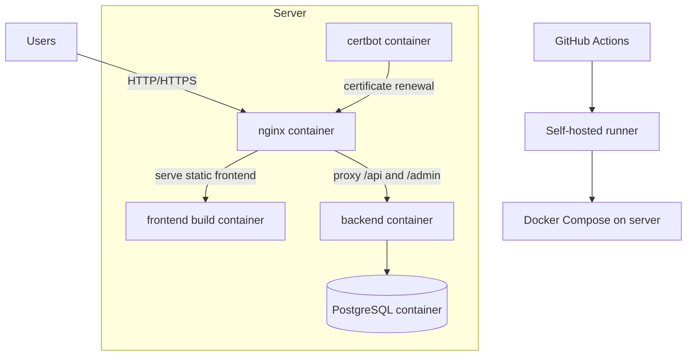
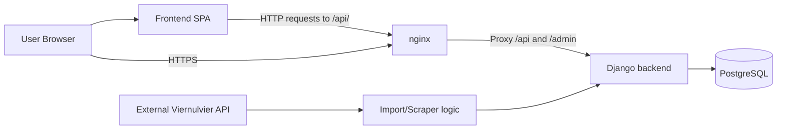

# Architecture

This page documents the high-level architecture of the project.

## System Overview

The project is a web application with a React frontend, a Django backend, and a PostgreSQL database.

At a high level:

- the frontend provides the user interface
- the backend exposes a REST API and contains the business logic
- PostgreSQL stores the application data
- nginx serves the built frontend and proxies API traffic to Django
- Docker Compose is used to run the full stack in staging and production
- a self-hosted GitHub Actions runner is used for CI and deployment

## Deployment Architecture

The production deployment uses multiple Docker containers on a single server.

### Container Roles

- `nginx` is the public entry point
- `backend` runs Django, applies migrations, and serves the API
- `frontend` builds the static frontend assets
- `database` stores persistent data
- `certbot` manages TLS certificate renewal
- the self-hosted runner executes CI and deployment workflows on the server

## Runtime Architecture

### Request flow

1. A user opens the frontend in the browser.
2. nginx serves the built frontend files.
3. API requests are routed through nginx to the Django backend.
4. The backend processes the request and reads or writes data in PostgreSQL.
5. For synchronization tasks, the backend also talks to the external Viernulvier API.
